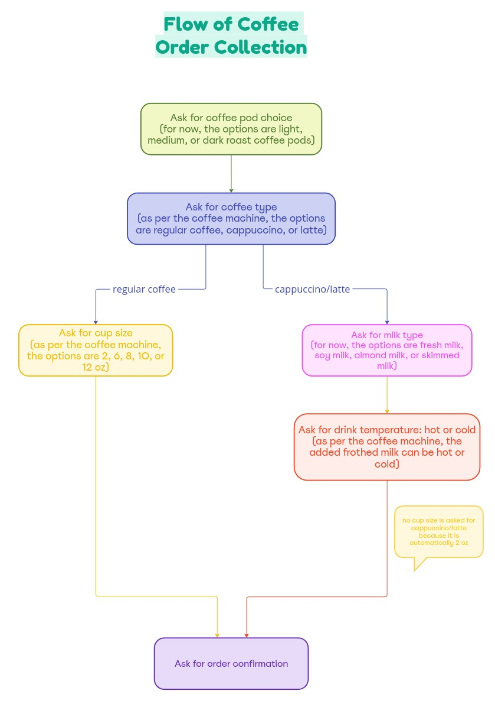

# Coffeebot: NYU-AD RoboCafe Project

## Overview
Coffeebot is a chatbot barista developed for the NYU-AD RoboCafe research project. It leverages the [Pipecat framework](https://github.com/pipecat-ai/pipecat) for multimodal conversations to take user-specific coffee orders. Coffeebot is tailored to operate according to the specifications of the Keurig K-Cafe Single Serve K-Cup Coffee, Latte, and Cappuccino Maker, meaning each order is crafted according to the options available on this specific machine. For its implementation, Coffeebot utilizes [MeetKai Functionary](https://github.com/MeetKai/functionary) for the language model (LLM), Tacotron2 (trained on the LJSpeech dataset and accessed through [Coqui-ai](https://github.com/coqui-ai/TTS)) for text-to-speech (TTS), and [Daily-co](https://www.daily.co/) for speech-to-text (STT). The user interface is based on a modified version of [Pipecat-ai’s web-client UI](https://github.com/pipecat-ai/web-client-ui).

## Coffee Ordering Process
Below is an overview of the interaction flow Coffeebot uses to guide users through placing their coffee orders. This flowchart represents how the chatbot interacts to ensure user preferences are accurately captured.



Through the (Functionary LLM](https://github.com/MeetKai/functionary), the chatbot engages in dynamic conversations with users, making function calls when necessary to process the user inputs.

### Detailed Flow Description
- **Coffee Pod Choice:** The chatbot starts by asking the user to choose a coffee pod. The options available are light, medium, or dark roast coffee pods.
- **Coffee Type Selection:** The user is then asked to select the type of coffee they want. The options, as per the coffee machine, are regular coffee, cappuccino, or latte.
  - **Regular Coffee:** The user is prompted to choose the cup size next, with options including 2, 6, 8, 10, or 12 ounces.
  - **Cappuccino/Latte:** The user is asked to specify the type of milk (fresh, soy, almond, or skimmed milk) and the drink temperature (hot or cold). Note that the cup size for cappuccino and latte is fixed at 2 ounces as per the coffee machine’s default setting.
- **Order Confirmation:** Once all preferences are specified, the chatbot confirms the order with the user to ensure accuracy before processing.

### Dynamic Order Handling
Coffeebot is designed to adapt to the user's input style, processing orders either in part or in full. This flexibility allows users to provide all coffee details at once or progressively throughout the interaction.

- **Complete Order Input:** If a user specifies all details upfront (e.g., "I would like a dark roast pod in a cold cappuccino with almond milk"), Coffeebot will directly move to confirm the order without further queries.
- **Partial Order Input:** If a user starts with partial details (e.g., "I want a dark roast pod for a cappuccino"), Coffeebot will then ask for the remaining details, such as milk type and temperature.

This guarantees a smooth and efficient ordering process, similar to the conversational style of a human barista.

## Running Coffeebot

### Prerequisites: Hardware Requirements
Coffeebot requires powerful hardware, particularly strong GPUs, to effectively host the computationally intensive LLM and TTS models.

#### For General Users
Ensure you have access to a machine or server equipped with adequate GPU resources. Detailed steps on how to configure and run the LLM and TTS APIs are provided below to guide you through the necessary setup to get Coffeebot operational.

#### For NYU Students
NYU students may have the option to access university-provided servers that are equipped with the necessary hardware to support these models. If you are an NYU student and need access to these resources, please reach out to me for assistance at sohaila.mohammed@nyu.edu. After consulting with relevant faculty, I can provide you with the details required to configure your `config.sh` file. This will allow you to connect to NYU's servers and run the Coffeebot project.

### Prerequisites: Daily Co Setup
Before you begin, you'll need to set up your Daily account to obtain the necessary API key and URL:

**Getting Daily API Key:**
1. Create a [Daily](https://www.daily.co/) account.
2. Login to your account and find the “Developers” section in the side menu of the landing page.
3. There you will find the API key.
4. Copy the key to save it for later use.

**Getting Daily Room URL:**
1. Login to your Daily account and find the “Rooms” section in the side menu of the landing page.
2. Click on the “Rooms” section and find the “Create room” button.
3. Click on “Create room” then you can add a room name (otherwise it will be a randomly generated string), but simply keep the default settings and confirm room creation.
4. You will then be redirected back to the “Rooms” section and you should find the room you created under the “Your rooms” section.
5. Click on the name of the room you created, then you will be able to see all of the room’s information, including its URL.
6. Copy the URL to save it.

### Clone the Repository
```bash
git clone https://github.com/Sohaila-Abdulsattar-Mohammed/RoboCafe-Coffeebot-NYU-AD.git
cd RoboCafe-Coffeebot-NYU-AD
```

### Install Dependencies
```bash
pip install -r requirements.txt
```

### Specific Setup Instructions

#### For General Users
1. **Setup TTS API:**
   - The file you will need to run is the `coqui_api.py` file provided in this repository. You can copy it wherever you need to run it.
   - Run the TTS API using the command:
     ```bash
     python3 coqui_api.py
     ```
   - Note the URL at which your TTS API is running.

2. **Setup LLM API:**
   - Clone the [MeetKai Functionary](https://github.com/MeetKai/functionary) repository where you will be running the LLM:
     ```bash
     git clone https://github.com/MeetKai/functionary.git
     ```
   - Navigate to the functionary directory:
     ```bash
     cd functionary
     ```
   - Install the required modules:
     ```bash
     pip install -r requirements.txt
     ```
   - Run the LLM API using the command:
     ```bash
     python3 server_vllm.py --model meetkai/functionary-small-v2.5
     ```
   - Note the URL at which your LLM API is running.

#### For NYU Students
1. **Server Access:**
   - Create a `config.sh` file with the necessary details (which will be provided to you) to access NYU’s servers.

### Configure Environment

1. **Create and Configure .env File:**
   - Make a copy of the `env.example` file and rename it to `.env`:
     ```bash
     cp env.example .env
     ```
   - Fill in the necessary details in the `.env` file:
     ```plaintext
     DAILY_SAMPLE_ROOM_URL=your_daily_room_url
     DAILY_API_KEY=your_daily_api_key
     TTS_URL=your_tts_api_url
     LLM_URL=your_llm_api_url
     ```
     - `DAILY_SAMPLE_ROOM_URL`: The room URL you obtained as per the instructions in the prerequisites section.
     - `DAILY_API_KEY`: The API key you obtained from Daily as per the instructions in the prerequisites section.
     - `TTS_URL`: The URL at which your TTS API is running.
     - `LLM_URL`: The URL at which your LLM API is running.

   **Note for NYU Students:**
   - The TTS and LLM URLs will be provided to you.

2. **Configure Web UI Environment:**
   - Navigate to the `webui` directory:
     ```bash
     cd webui
     ```
   - Create a `.env.development.local` file:
     ```bash
     touch .env.development.local
     ```
   - Add the following configuration details to the `.env.development.local` file:
     ```plaintext
     VITE_APP_TITLE=Coffee Bot
     VITE_SERVER_URL=http://localhost:7860
     ```

### Running the Application

#### For General Users
1. **Ensure LLM and TTS APIs are Running:**
   - Make sure both your LLM and TTS APIs are running and accessible.

2. **Start the Coffeebot Server:**
   - Navigate to the main Coffeebot directory and start the server:
     ```bash
     python3 server.py
     ```

3. **Start the Web UI:**
   - Open a new terminal, navigate to the `webui` directory, and execute the following commands:
     ```bash
     yarn
     yarn run build
     yarn dev
     ```

4. **Access the Web UI:**
   - Open your browser and go to `http://localhost:5173/` to interact with the Coffeebot web interface.

#### For NYU Students
1. **Start All Necessary Processes:**
   - Execute the provided script to start all necessary processes:
     ```bash
     bash start_coffeebot.sh

2. **Access the Web UI:**
   - Wait for the confirmation message indicating all processes are running, then open your browser and go to `http://localhost:5173/` to interact with the Coffeebot web interface.

3. **Debugging:**
   - To debug errors, you can stop the processes with `Ctrl+C` and view the following log files:
     - `server.log` for server-related issues.
     - `functionary.log` for LLM-related issues.
     - `coqui.log` for TTS-related issues.
     - `webui.log` located under the `webui` directory for UI-related issues.


